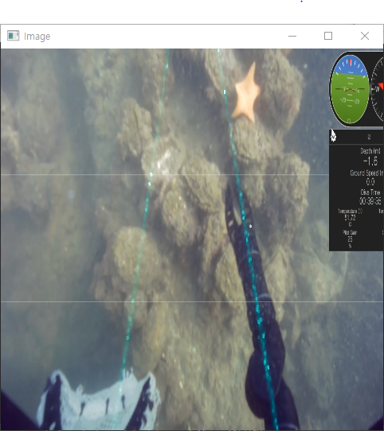
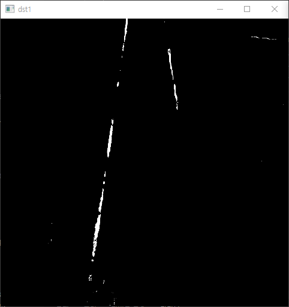
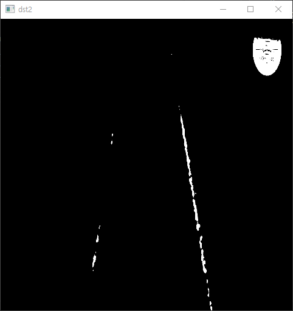

# Color_Extraction
> 레이저를 추출하기 위해서, 필터를 생성

## How to use?
1. 필터를 정하고, 적용하면 레이저가 있는 부분만 추출된다. 

## install Library
```
pip install opencv-python
```

## Example

### (60, 40, 40) ~ (90, 255, 255)

### (30, 110, 110) ~  (100, 255, 255)

### bitwise_or(filter1, filter2)

